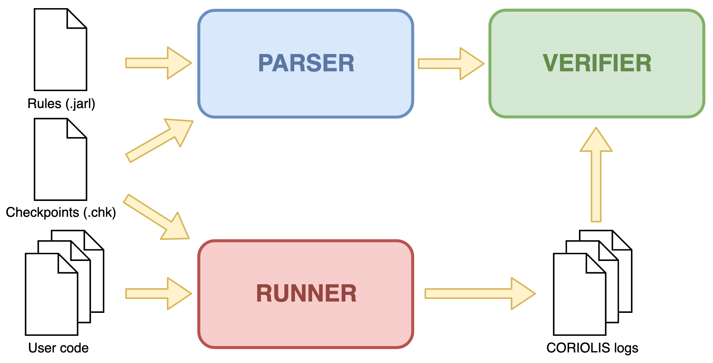

# CORIOLIS: Rule-based concurrent testing system


> _Le temps n'est pas éloigné, sans doute, où le travail s'employant davantage, s’économisera mieux, et où l’intérêt qu’on aura à connaître tous ces résultats fera chercher par expérience ceux qui ne peuvent s’obtenir directement par la théorie._

> _The time is not far away, no doubt, where the future work being done, will save itself better, and where the interest which we will have to know all these results will make us search by experience those which can not be obtained directly by theory._


## Abstract

CORIOLIS is a CLI-based framework for running and testing concurrent software. Concurrent test suites are written as [JARL rules](docs/jarl_spec.md), with checkpoints inserted in the code as one-line comments. User's code is executed on a virtualized environment, and the resulting logs from such execution are analyzed for verifying the defined rules.  

## Table of contents

- [CORIOLIS overview](#coriolis-overview)
- [Installation guide](#installation-guide)
- [Quick start](#quick-start)
  - [Running Python example](#running-python-example)
  - [Running Rust example](#running-rust-example)
  - [Running C/C++ example](#running-cc-example)
- [Parsing JARL rules](#parsing-jarl-rules)
- [Running user's code](#running-users-code)
- [Verifying JARL rules](#verifying-jarl-rules)

## CORIOLIS overview

CORIOLIS system basically consists of three well-defined parts: 

- A _parser_ which can validate JARL rules and translate them into an internal CORIOLIS representation.
- A _runner_ able to execute the user's code on a virtualized environment, that produces output logs with the execution information.
-  A _verifier_ module that asserts the runner logs are compliant with the parsed rules.

Input files and the relationships between these three parts are summarized on the following image: 



## Installation guide

TODO: Fill me with installation steps

## Quick start

**Note**: In order for your project to run with CORIOLIS, you must place on it a Bash `run_coriolis.sh` script. Such script should be the responsible for compiling and running your code like you would do it on your machine.

The easiest way to use CORIOLIS is with the basic `coriolis` command. You will want to specify, at least, your source code directory, your JARL rules file, the checkpoints table related to your code, and the language used in your project: 

```
~$ coriolis -s myproject/src -r myrules.jarl -c mycheckpoints.chk -l py
```

**Note**: Remember CORIOLIS uses Docker on the background, so your user must have enough permissions to use the `docker` command.

You can check all flags with `coriolis -h`:

```
~$ coriolis -h
usage: coriolis [-h] [-s source] [-r rules_file] [-c checkpoints]
                [-d destination] [-l language] [-n number] [-t secs]
                [-H mongo_host] [-p mongo_port] [-v] [-C]
                {verify,run,parse} ...

Coriolis CLI tool

positional arguments:
  {verify,run,parse}

optional arguments:
  -h, --help            show this help message and exit
  -s source, --source source
                        Source code directory
  -r rules_file, --rules rules_file
                        Rules .jarl file
  -c checkpoints, --checkpoints checkpoints
                        Checkpoint list file
  -d destination, --destination destination
                        Logs destination directory
  -l language, --language language
                        Source code language
  -n number, --number-runs number
                        Number of runs to perform
  -t secs, --timeout secs
                        Number of seconds to wait before timeout
  -H mongo_host, --mongo-host mongo_host
                        Host or IP of the mongo server
  -p mongo_port, --mongo-port mongo_port
                        Port of the mongo server
  -v, --verbose         Enables verbosity
  -C, --clean           Cleans logs after usage
```

Some useful tips:

- Setting the `-v` flag will make CORIOLIS generate a more verbose output. This will show more information on errors, like why a rule has not passed.
- The `--timeout` argument controls how many seconds will CORIOLIS wait before forcefully stopping each run of the program under test. Using a value of `0` executes the program on 'interactive mode'.
-  Currently, the languages available are C, C++, Python and Rust. Their values to pass to the `-l` argument are, respectively, `c`, `cpp`, `py` and `rs`.
- CORIOLIS use MongoDB on the background. If, for some reason, you want to specify a custom MongoDB instance, use the `--mongo_host` and `--mongo_port` arguments.

The CORIOLIS repository already have several examples for every supported language. The following sections explain how to run several of these examples using the previous `coriolis` command.

### Running Python example

A Python implementation of the readers and writers problem can be found on the CORIOLIS repository inside `examples/readersWriters`. Assuming you are on the repository home folder, you can inspect the contents of the `run_coriolis.sh` file to confirm it just runs the code:

```
~$ cat examples/readersWriters/run_coriolis.sh
#!/bin/bash

python3 main.py
```

You can run the example with `coriolis` like the following:

```
~$ coriolis -l py -s examples/readersWriters/ -r coriolis/resources/readers_writers_1_rules.jarl -c coriolis/resources/readers_writers.chk -C
```

### Running Rust example

TODO: Show how to run philosophers example

### Running C/C++ example

TODO: Show how to run smokers example

## Parsing JARL rules

TODO: Briefly explain `coriolis parse` command

## Running user's code

TODO: Briefly explain `coriolis run` command

## Verifying JARL rules

TODO: Briefly explain `coriolis verify` command

